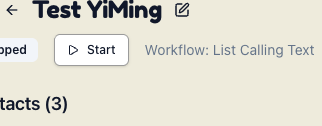
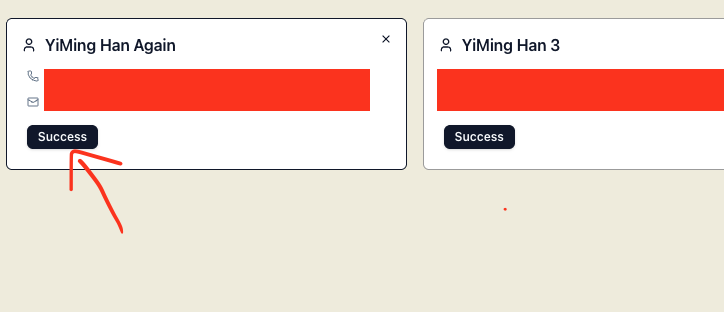

One of the common use cases for AI automation is to call a list of contacts.  This guide explains how to setup list calling with your dedicated number.

# Creating a list

There are 2 ways to create a list:

1. in /contacts page, select **Upload Contacts** and upload a CSV.  A list will be automatically created. 

2. Create a list directly via **Create List** in /contacts page.

# Start List Calling 

Once you have a list, first **make sure** that the numbers in the list are correct (with country codes)

then, click the **Start List** button inside the list detail page.

Choose the workflow and phone number you want for the list, and our AI will start automating calls sequentially in the background.  You do not need to keep the page open.

# List Calling Status

Once list calling starts, you should be able to see call status and call details in the list details page

# List calling with multiple numbers

We are still testing out multiple numbers for list calling.  If you would like to be a test partner - email us at yiming@callcow.ai