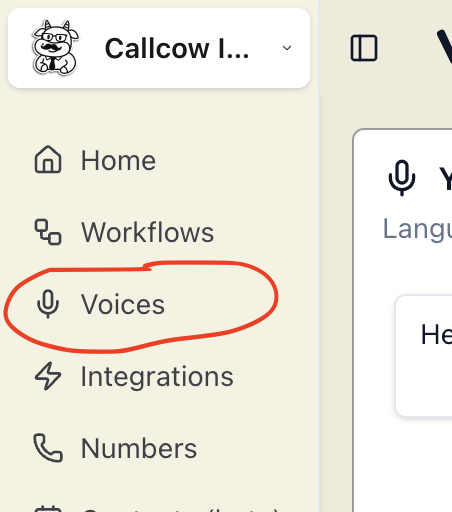
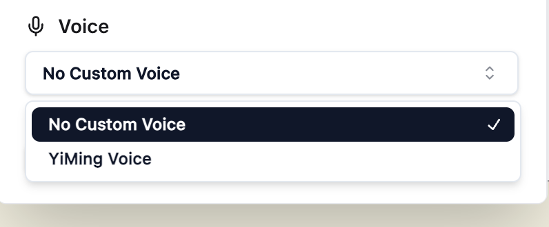

# Voice Cloning

You can clone your voice in 2 easy steps:

1. Select the voice tab in the sidebar

2. Record a 30 second audio snippet and clone your voice!

And that's it! You are done! You can now use your cloned voice in all workflows

# Security Considerations

We do not store any audios of your actual calls, only the 30 second audio snippet will be used for voice cloning.
