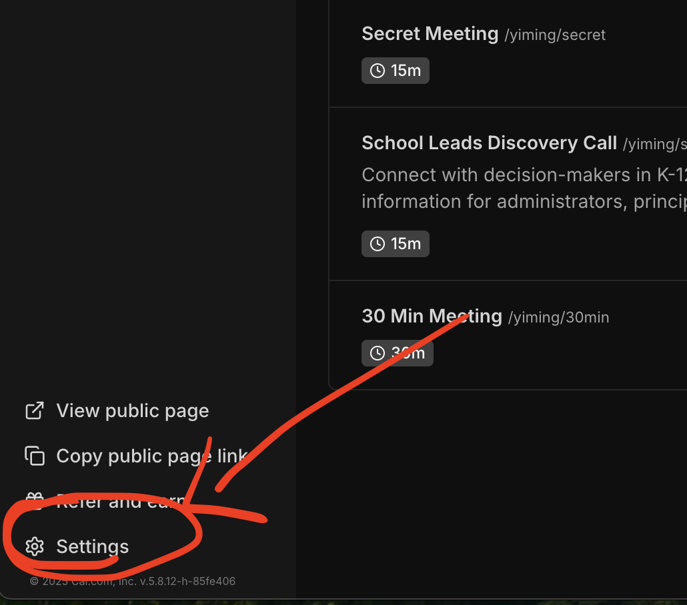
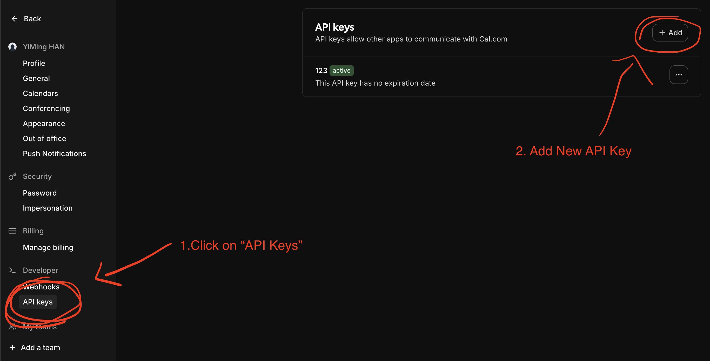
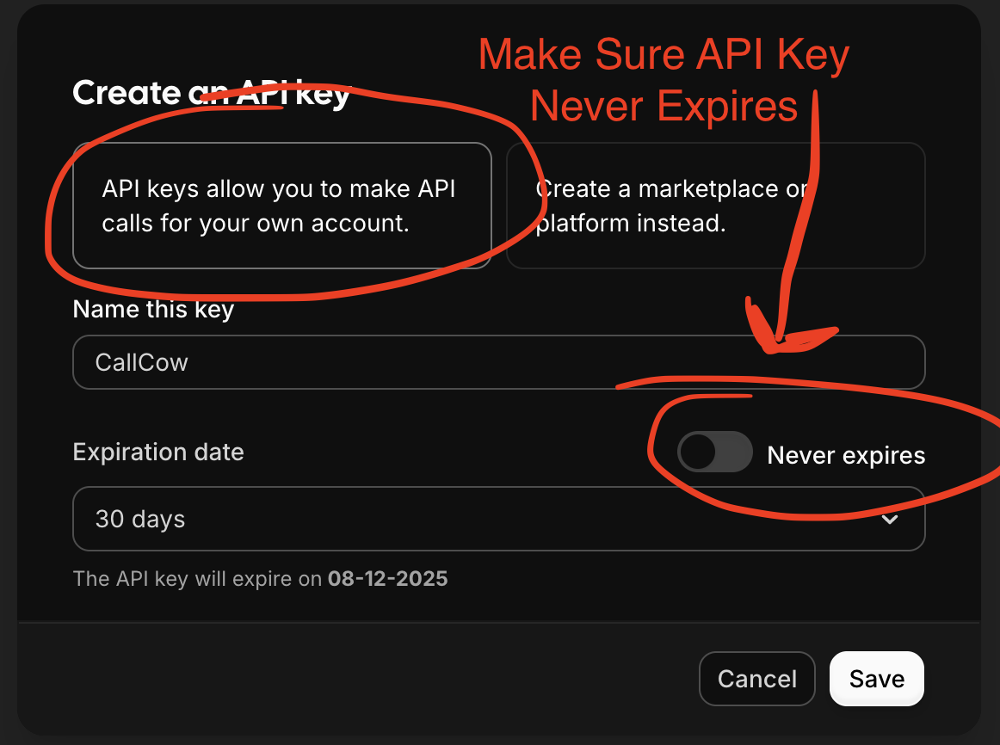
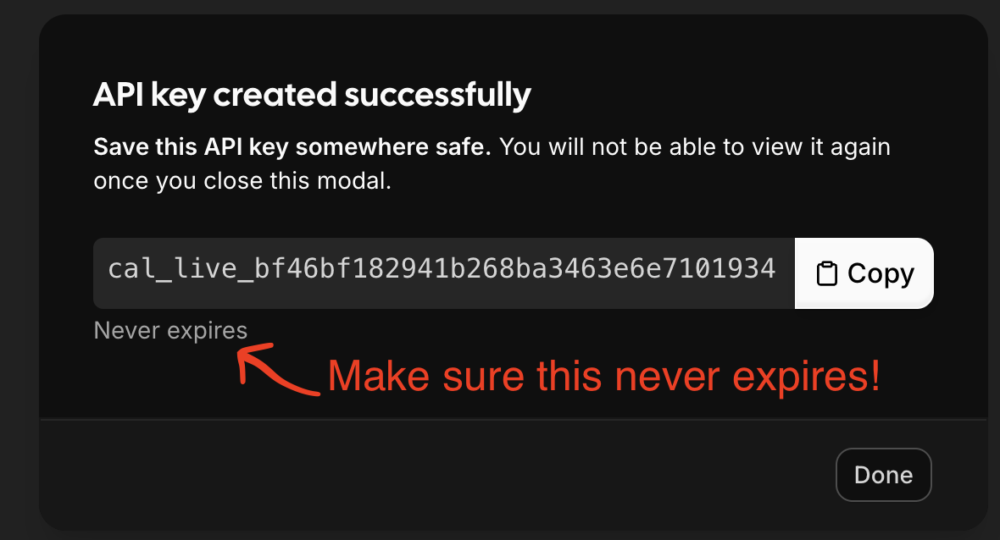

For Cal.com Integration, you will need to configure an API key for us to create schedules for you on your behalf.

Here's the step by step guide to get your API KEY:

1. Go to app.calcom.com, and go to the settings page

2. Click on API Keys in Settings and create a new API Key

3. Make sure the key never expires.

4. Make sure to double check that the key never expires before copying it for CallCow!

## Security Considerations

Using an API Key in this way is <b>100% Safe</b>.

Any time you feel like you want to stop connecting to CallCow, just remove the integration and remove the key on cal.com settings page.

There is no way for us to access your calendar after.
