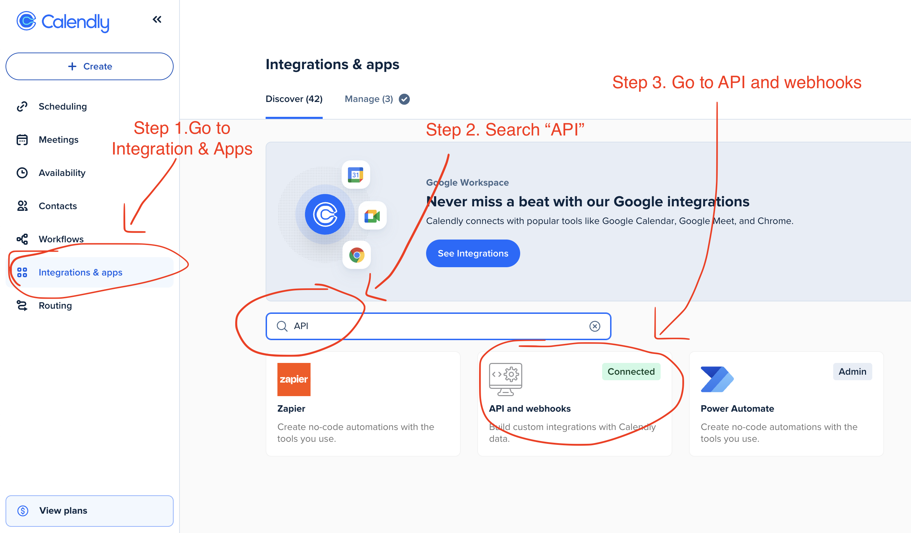
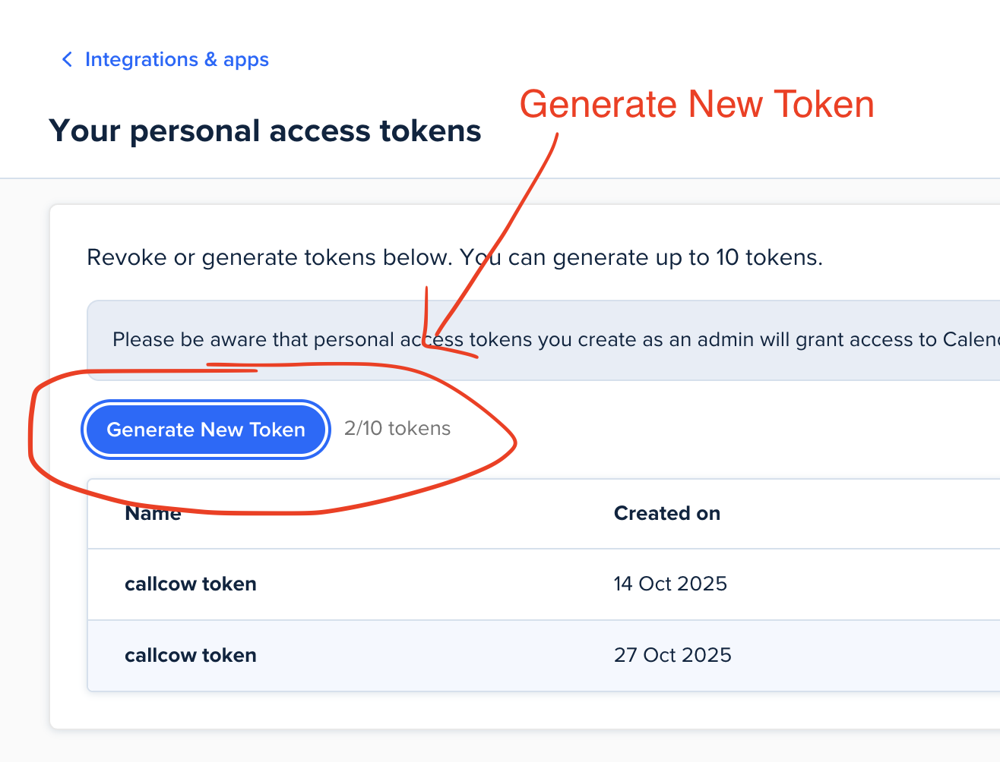
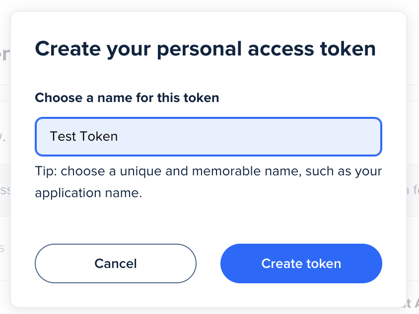

For Calendly Integration, you will need to configure an API key for us to create schedules for you on your behalf.

Here's the step by step guide to get your API KEY:

1. Go to [calendly.com/integrations](https://calendly.com/integrations), and go to the "integrations & apps" page.

Search for "API" in the integration and select "API and webhooks"

2. Click on "Generate New Token"

3. Proceed with generating your personal access token

4. Copy the access token

## Security Considerations

Using an API Key in this way is <b>100% Safe</b>.

Any time you feel like you want to stop connecting to CallCow, just remove the integration and revoke the key on the "API & webhooks" page

There is no way for us to access your calendar after.
