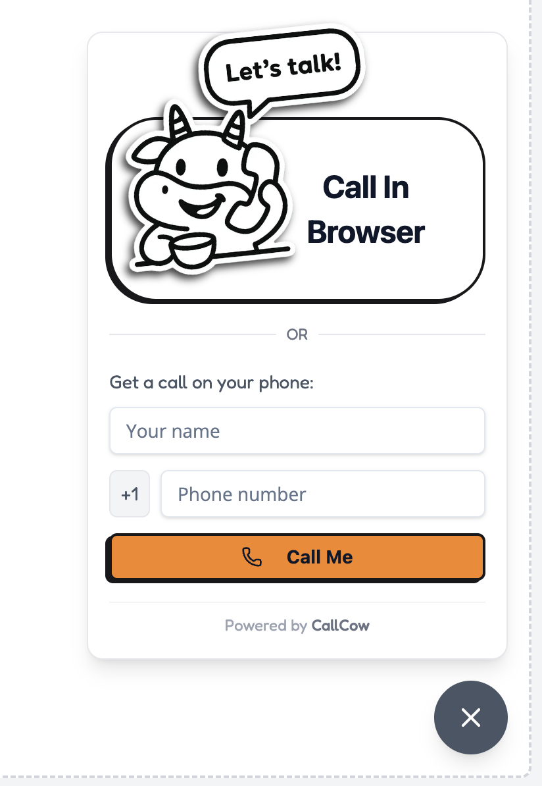
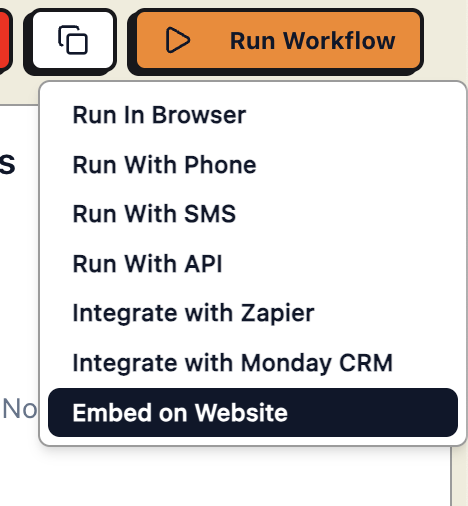

We currently offer 2 types of website widgets that you can easily embed into your website.

1. Floating Widget

Floating widget acts like any chat widget that just floats at the bottom right of the screen.

2. Inline Widget

You can put the inline widget in any of your website sections

# Getting the code to integrate

Click on **Embed on Website** inside the workflow page you want to use, and follow the integration instructions.

# Custom Widgets

If you need to help setup custom widgets or integrations, book a meeting with us [here](https://callcow.ai/schedule-custom).