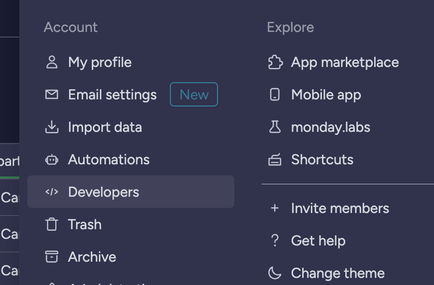
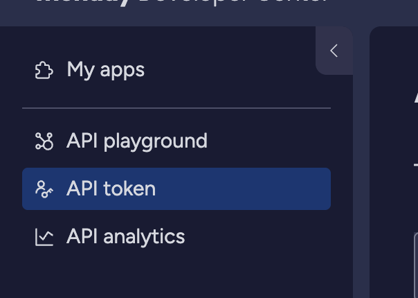
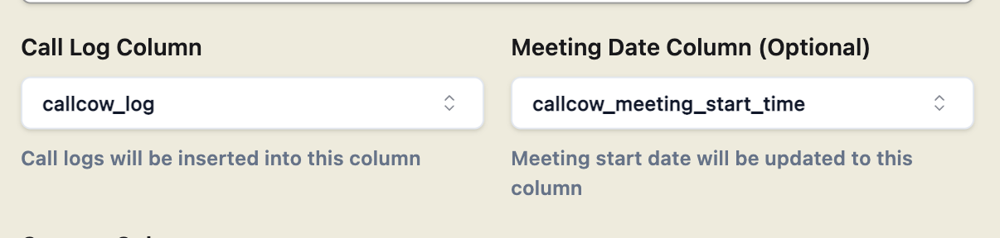
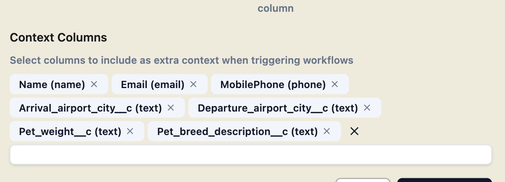
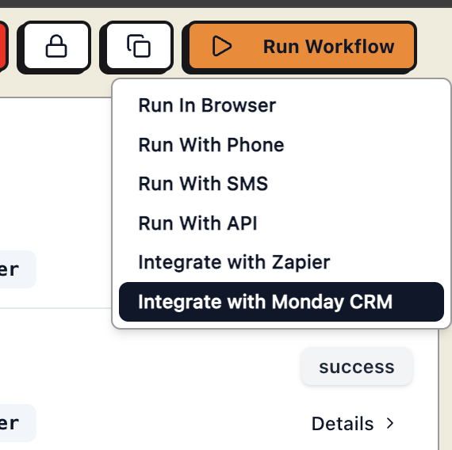
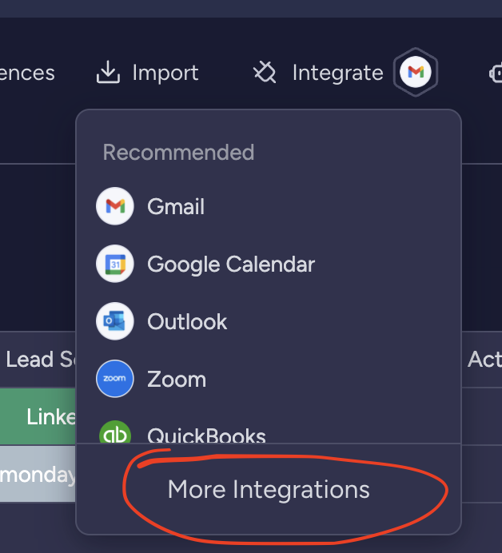
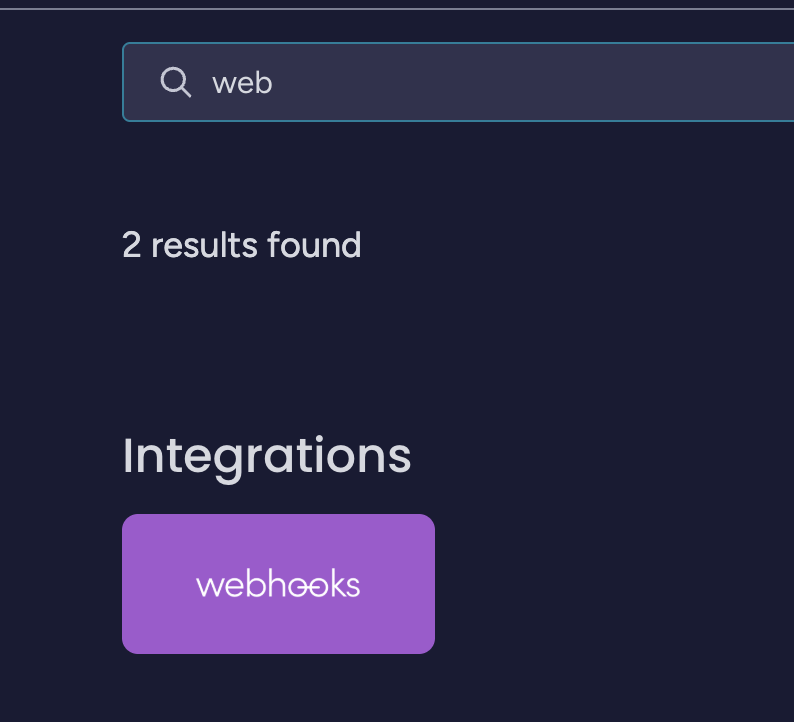
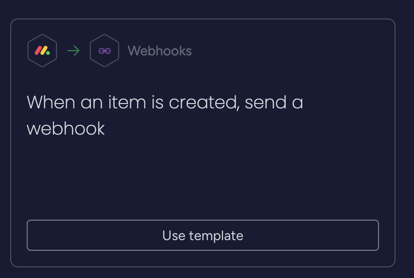
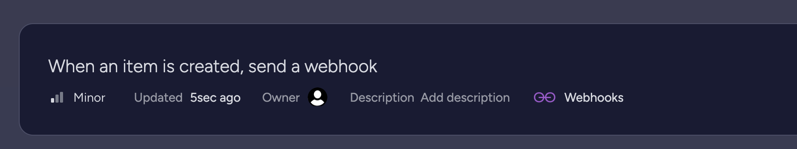

For Monday CRM Integration, you will need to configure an API key for us to integrate which boards are needed.

# Get Monday API Key

Here's the step by step guide to get your API KEY:

1. Go to **Developer Settings** and click on **API token**

2. Copy the API token

# Considerations when creating the integration

### Call logs are meeting dates:

Often we are using other monday CRM automation together with CallCow.

Creating new fields for **call log** and **meeting start time** helps with future automations, as they provide information for creating new calendar events and alert triggers for your CRM and syncs to your CRM as the source of truth.

### Extra call context:

It is normal to pass in extra call context to your calls. When creating your integration, add the extra context you would like to add and it will be passed to the call workflow.

# Trigger call workflow when a row is created

The most common way for Monday CRM integration to be used is to trigger a call when a new row is added.

To do this, make sure you have first created a Monday CRM integration with the board of your choosing in the **Integrations** Tab.

Go to **Run Workflow** section of the workflow you want to trigger, and copy the webhook link generated:

Follow the instructions to copy the webhook link, then go to your board, click **Integrate** -> **More Integrations**

Create a webhook for **When an item is created, send a webhook**.

Copy the webhook link into the webhook.

Create the automation. You should see something like this:

## Custom Setup

If you need help setting up a custom solution, you can book a meeting with us [here](http://callcow.ai/schedule-custom).

## Security Considerations

We **ONLY** use use the API key to fetch the new row that was created and update call status to it.

CallCow never stores any data from your CRM, only the call logs.
