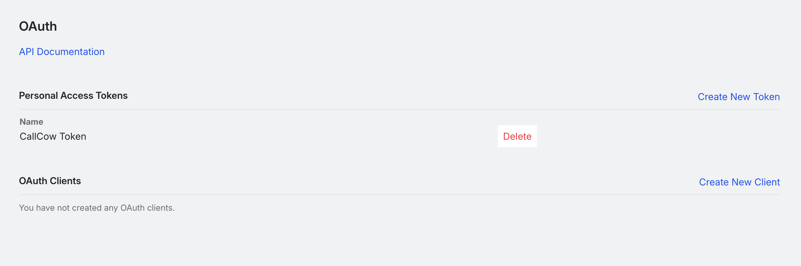
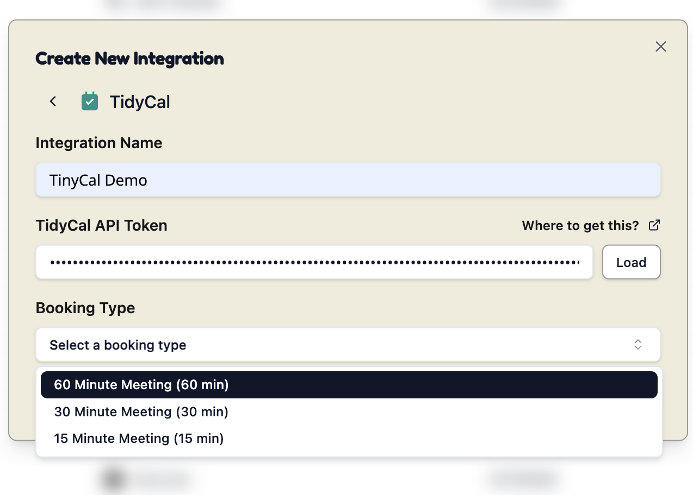

For TidyCal Integration, you will need to configure an API key for us to create schedules for you on your behalf.

Here's the step by step guide to get your API KEY:

1. Go to [tidycal.com/integrations/oauth](https://tidycal.com/integrations/oauth) and log in to your account

2. Generate APIKEY and copy it

3. Add the key and add the event you want with your tidycal.  Note that paid booking cannot be booked via API - thuse they cannot be included.

## Security Considerations

Any time you feel like you want to stop connecting to CallCow, just remove the integration and revoke the key on tidyCal's settings page.

There is no way for us to access your calendar after.
