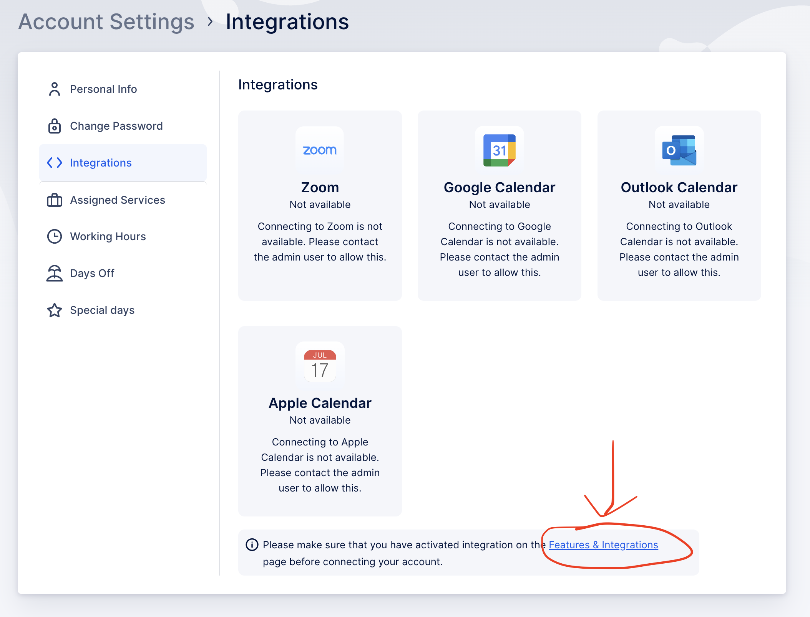
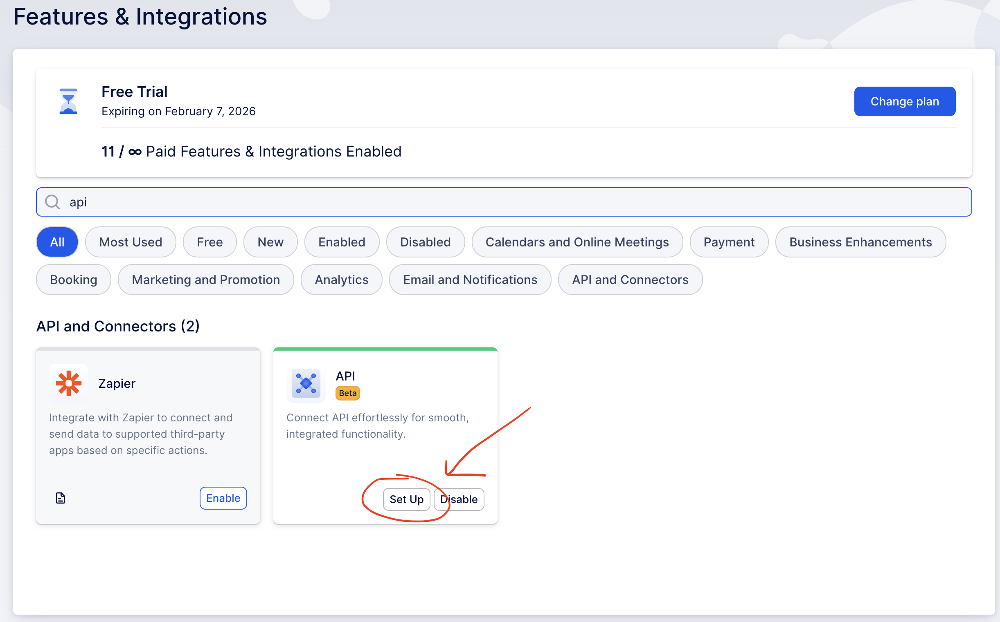
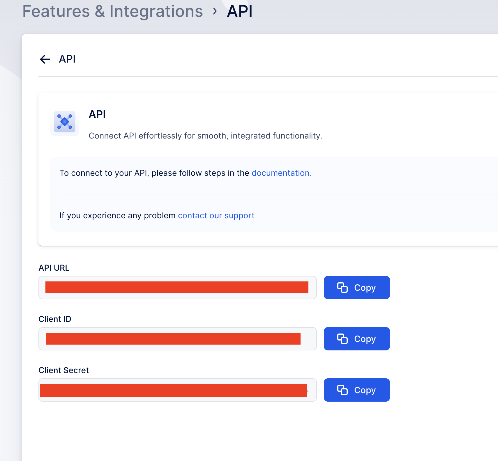
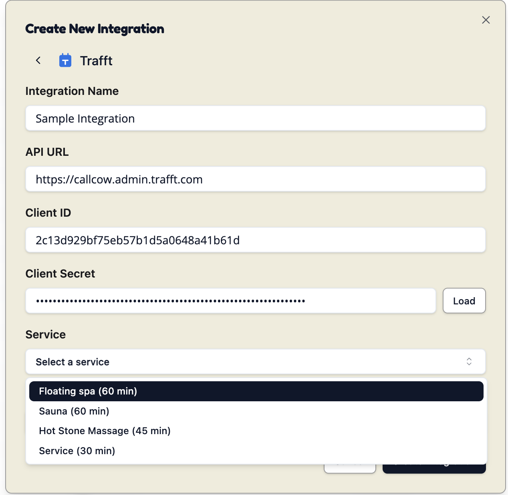

For Trafft Integration, you will need to configure an API key for us to create appointments and manage bookings on your behalf.

Here's the step by step guide to get your API KEY:

1. Go to your Trafft admin panel and navigate to **Account Settings**, click on **Features and Integrations**.

2. Search for **API** and click **Set up**.

3. Copy the API Keys and other secrets 

4. Copy the settings to CallCow API

## Configuring Your Trafft Integration

Once you have your API key, you'll also need:

- **Service ID**: The specific service you want CallCow to book appointments for

You can select a number of services for each integration. 

We recommend create different integrations for different services if you want to have different services for different workflows.

## Booking Rules:

We will book the first employee that is available for the timeslot.  Currently there are no specific bookings for different employee.

## Security Considerations

Any time you feel like you want to stop connecting to CallCow, just remove the integration and revoke the API key in your Trafft settings.

There is no way for us to access your Trafft account after.
