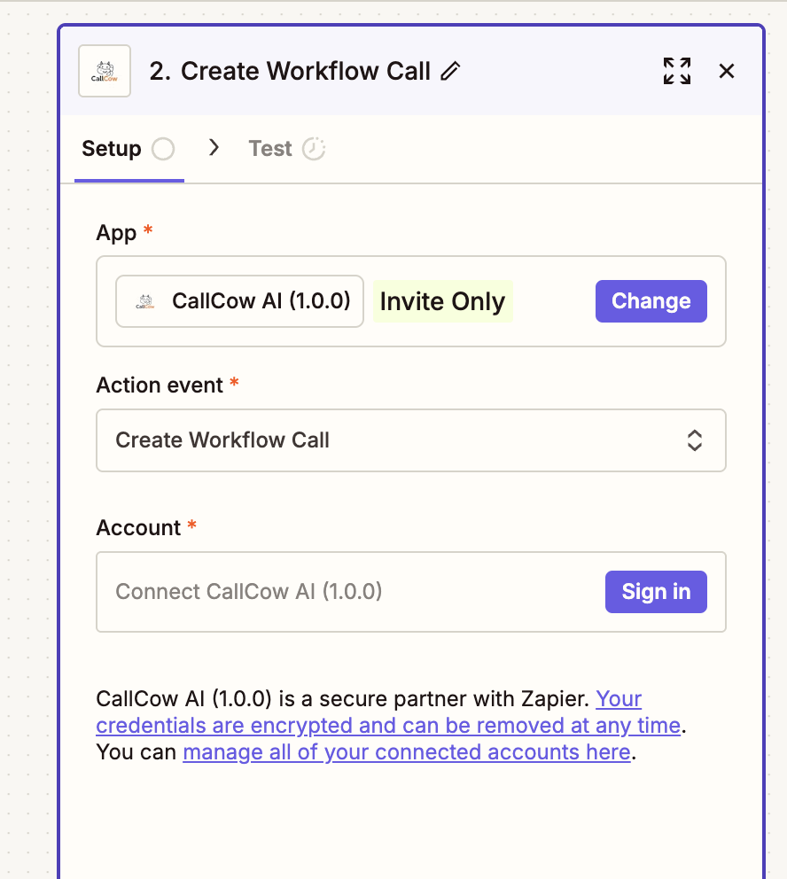
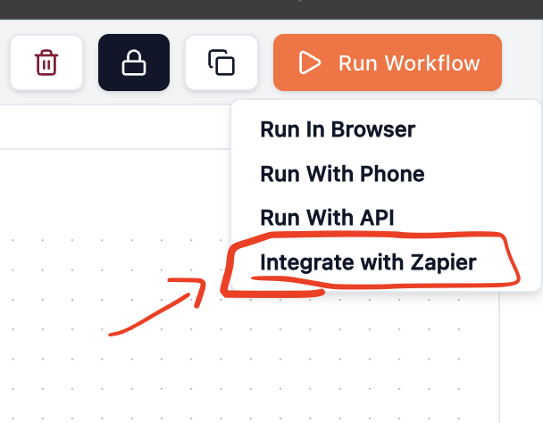
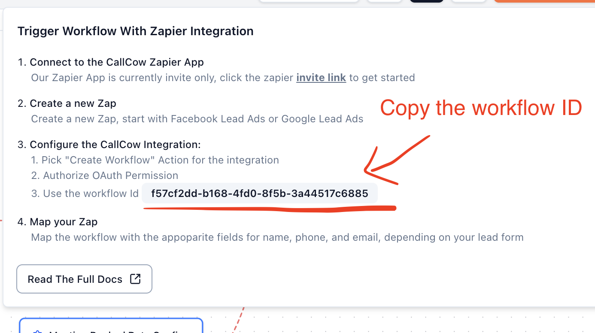
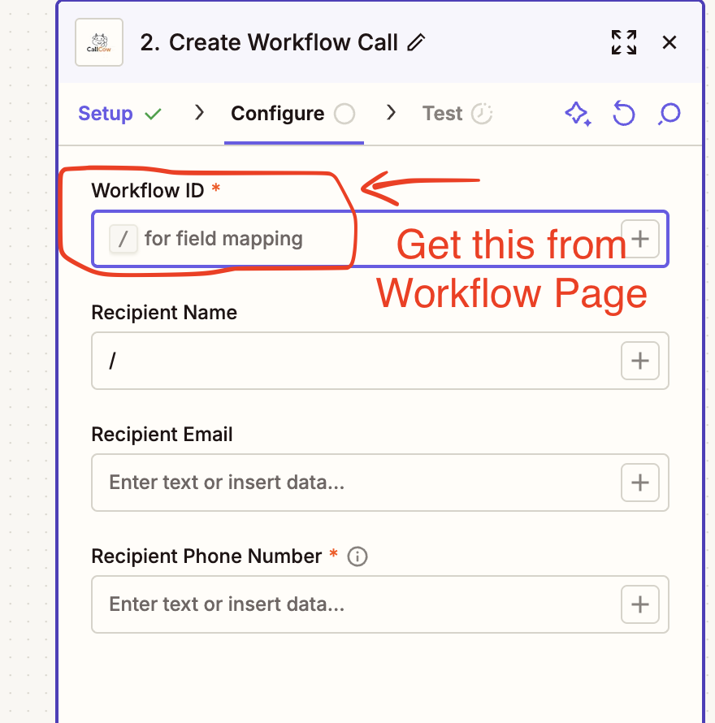

## Setting Up CallCow with Zapier

Follow these steps to integrate CallCow with your lead generation workflows:

### 1. Connect to the CallCow Zapier App

Our Zapier App is currently invite only. Click the [**Zapier invite link**](https://zapier.com/developer/public-invite/232727/45c3209dfedcd445fe42140ec0463703/) to get started.

### 2. Create a new Zap

Create a new Zap, starting with Facebook Lead Ads or Google Lead Ads as your trigger.

Or, if you have any other lead form integration, make sure it takes phone numbers

### 3. Configure the CallCow Integration

1. Pick "Create Workflow" Action for the integration

2. Authorize OAuth Permission
3. Use your workflow ID from CallCow (found in your workflow settings)

### 4. Map your Zap

Map the workflow with the appropriate fields for name, phone, and email, depending on your lead form configuration.
