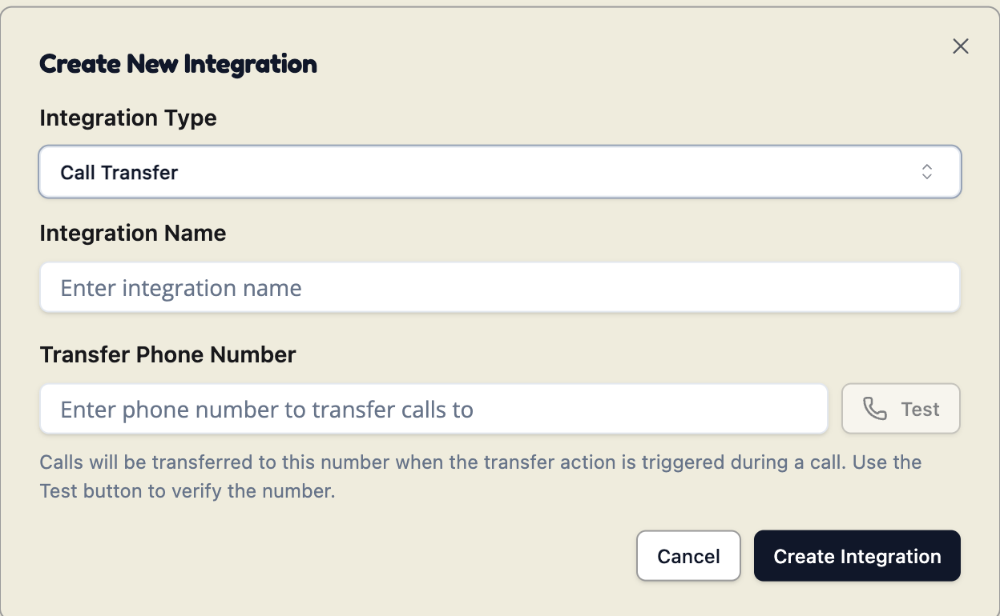
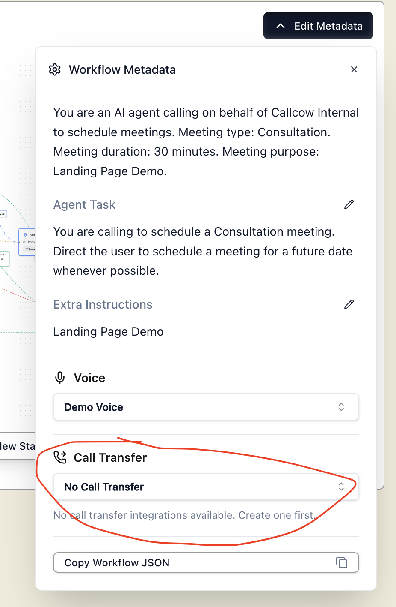
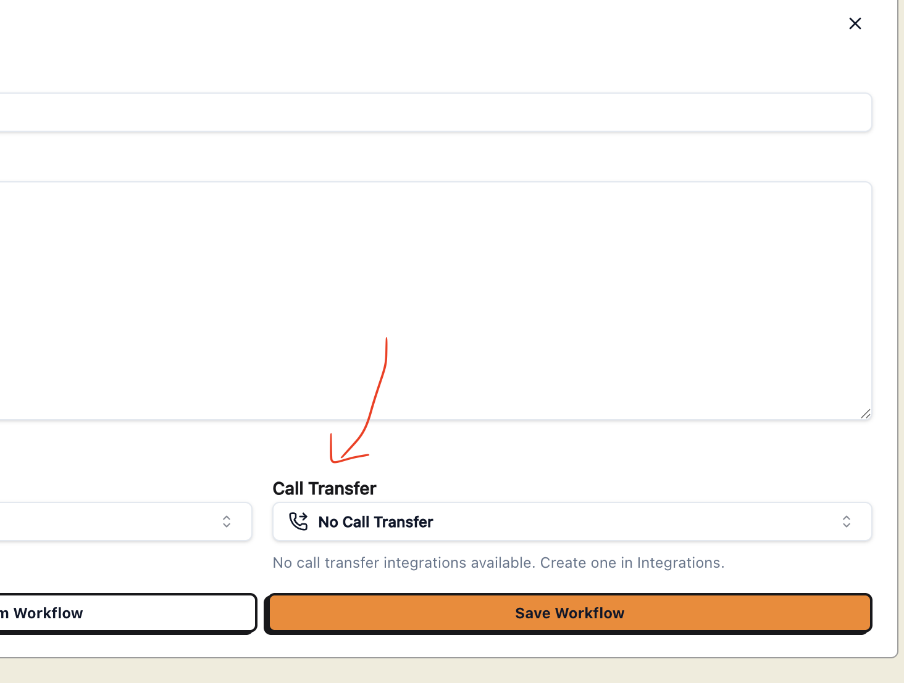

In some cases, the caller will still perfer to talk to a human.  Here's how to setup call transfer to a specific number you choose (for example, your business line.)

<Warning>
  **Primary Customer Profile Required**

  To enable call transfers, you must set up a Primary Customer Profile in your Twilio account. This is required by Twilio for outbound call capabilities.

  [Learn how to create a Primary Customer Profile](https://www.twilio.com/docs/trust-hub/trusthub-rest-api/console-create-a-primary-customer-profile)
</Warning>

First, create an integration for call transfer, and enter the number you which to use.  Make sure to test the number so it is valid.

Once this is save, you can update them in custom workflows via **Edit Metadata** or in basic workflows under the **Call Transfer** section:

