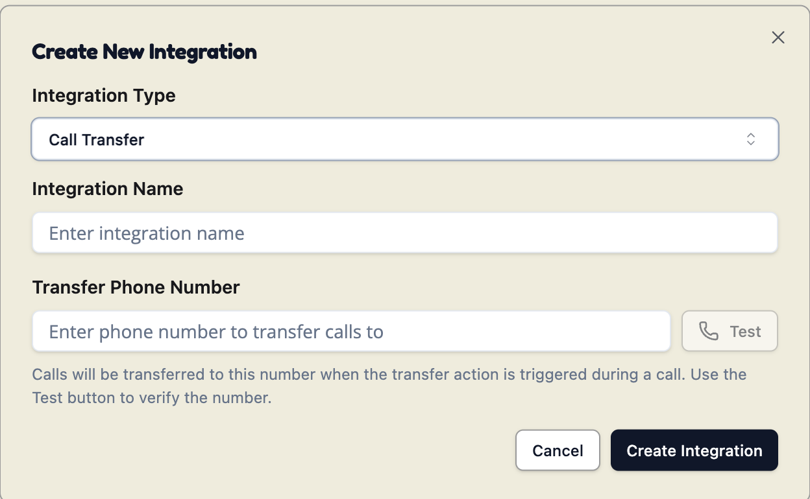
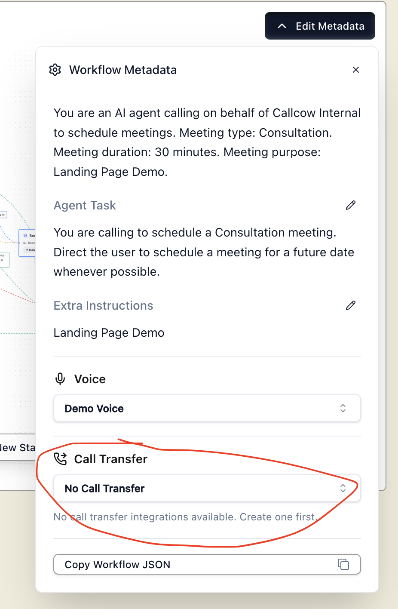
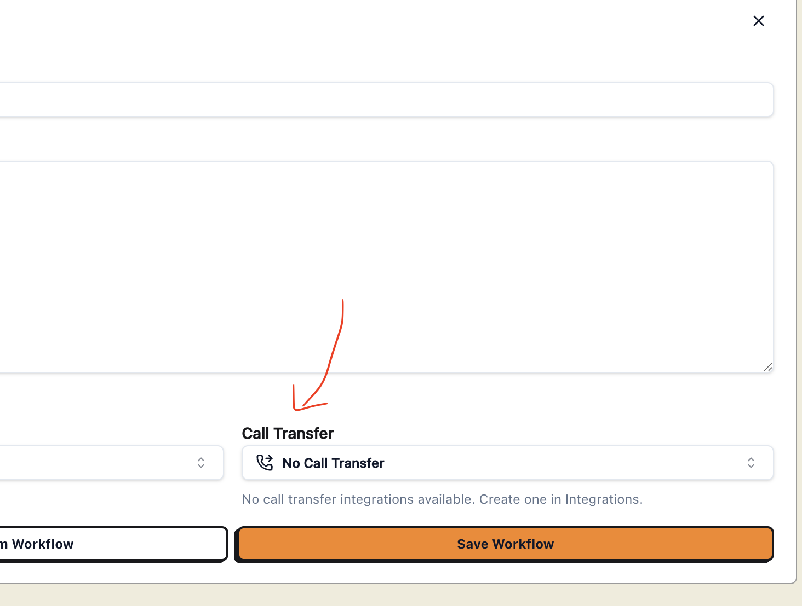

In some cases, the caller will still perfer to talk to a human.  Here's how to setup call transfer to a specific number you choose (for example, your business line.)

<Warning>
  **Primary Customer Profile Required**

  To enable call transfers, you must set up a Primary Customer Profile in your Twilio account. This is required by Twilio for outbound call capabilities.

  [Learn how to create a Primary Customer Profile](https://www.twilio.com/docs/trust-hub/trusthub-rest-api/console-create-a-primary-customer-profile)
</Warning>

First, create an integration for call transfer, and enter the number you which to use.  Make sure to test the number so it is valid.



Once this is saved, you can update them in custom workflows via **Edit Metadata** or in basic workflows under the **Call Transfer** section:




## Dynamic Transfer URL

If you need the transfer destination to change based on who is calling (e.g. routing to different departments or agents), you can set an optional **Dynamic Transfer URL** on the call transfer integration.

When configured, the agent will `POST` to your URL at the moment of transfer with the caller's phone number:

```json
{
  "number": "+15551234567"
}
```

Your endpoint should return a JSON response with the destination number:

```json
{
  "transferNumber": "+15559876543"
}
```

If the request fails or does not return a valid `transferNumber`, the agent will fall back to the static **Transfer Phone Number** you configured above.


