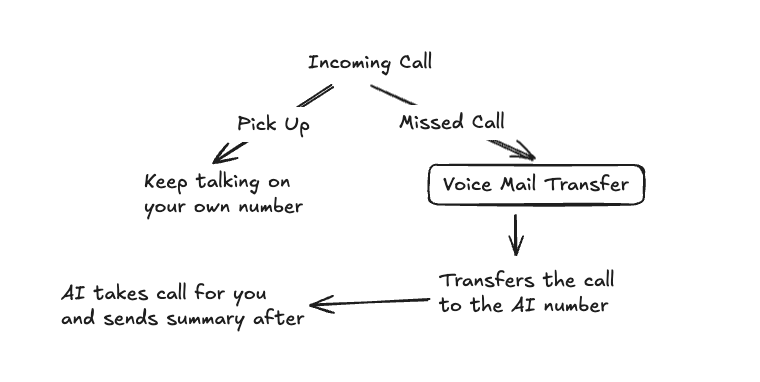

For most small businesses, our recommendation is do not let AI take 100% of your inbound calls.  Instead, let AI handle you calls ONLY when you fail to pick up the phone.

Traditionally, any missed call will be redirected to voicemail, but for most carriers, we can also setup voicemail forwarding. This feature lets you keep your personal calls, 
and forwards the caller to an AI agent only if you missed the call.

We find that this creates an overall best experience for clients.

# Setup Guide

To setup voice mail forwarding, the steps are different for each individual carrier.

To see a quick demo on what it looks like on Rogers, check our youtube short video for our guide: https://youtube.com/shorts/J7nBTLstdPU

If you need to help setup voice mail forwarding with your specific provider, book a meeting with us [here](https://callcow.ai/schedule-custom).